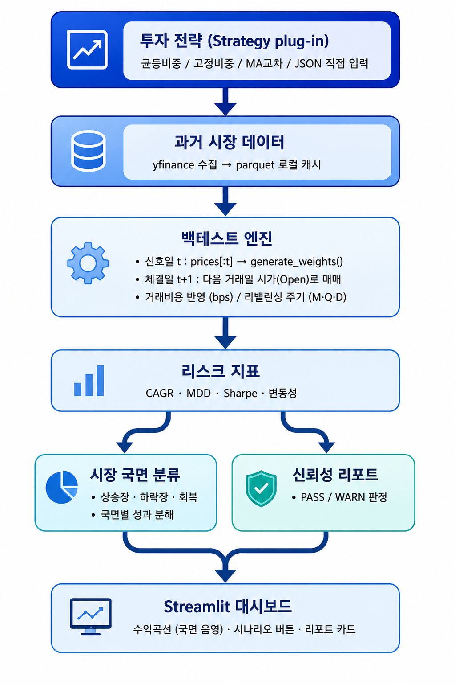

# 로보어드바이저 신뢰성 검증 테스트베드

투자 알고리즘(로보어드바이저)을 검증하는 평가 인프라. 어떤 전략이든 끼워 넣으면 신뢰성 지표를 자동으로 계산한다.

> 코스콤 RA테스트베드 개념을 이해하고 직접 구현해본 포트폴리오 프로젝트입니다. 실제 투자 자문이 아닙니다 (교육·포트폴리오 목적).

---

## 파이프라인



## 데모

**라이브 앱**: [https://ra-testbed-mmx3su4hwlbqrmwlc8yf3v.streamlit.app](https://ra-testbed-mmx3su4hwlbqrmwlc8yf3v.streamlit.app)

---

## 설계 결정

설계 결정은 이 프로젝트에서 가장 중요하게 다루는 부분입니다.

### 1. 전략 인터페이스 — Strategy ABC

모든 전략은 `Strategy` 추상 클래스를 상속하고 단 하나의 메서드를 구현한다.

```python
class Strategy(ABC):
    @abstractmethod
    def generate_weights(self, prices: pd.DataFrame) -> dict[str, float]:
        """
        prices: 신호 계산 시점까지의 종가만 포함 (엔진이 슬라이싱해서 전달)
        returns: {'SPY': 0.6, 'TLT': 0.3, 'GLD': 0.1}  합계 1.0
        """
```

**선택 근거:** 규칙 기반 전략이든 ML 기반 전략이든 동일한 시그니처를 따르면 백테스트 엔진을 전혀 수정하지 않고 전략만 교체할 수 있다. ABC 방식은 Protocol 방식 대비 `isinstance` 체크가 가능해 Phase 2의 사용자 전략 업로드 기능과 호환성이 좋다.

**현재 구현된 전략:**

| 전략 | 클래스 | 설명 |
|------|--------|------|
| 균등 비중 | `EqualWeightStrategy` | 모든 자산에 동일 비중 배분, 기준선 역할 |
| 고정 비중 | `FixedWeightStrategy` | 사용자 지정 비중 유지, 주기적 리밸런싱 |
| 이동평균 교차 | `MovingAverageCrossStrategy` | 단기 MA > 장기 MA인 자산에만 투자 |

---

### 2. Lookahead Bias 방지 — 가장 중요한 설계 결정

백테스트의 가장 흔한 오류는 전략이 미래 데이터를 보고 의사결정하는 것이다. 이 프로젝트는 이를 코드 레벨에서 구조적으로 차단한다.

```
신호일 (t):    prices.loc[:t] 만 전략에 전달 → 목표 비중 계산
체결일 (t+1):  다음 거래일 시가(Open)로 실제 매매 체결
```

엔진 내부 코드:

```python
# 핵심: signal_date까지의 종가만 전략에 전달 (미래 데이터 차단)
past_prices = close.loc[:signal_date]
target_weights = self.strategy.generate_weights(past_prices)

# 체결은 다음 거래일 시가(Open)로
exec_prices = open_.loc[execution_date]
```

전략 함수는 `signal_date` 이후의 데이터에 구조적으로 접근할 수 없다. 이 분리 방식은 테스트에서도 명시적으로 검증한다 (`tests/test_engine.py::TestLookaheadBias`).

**체결가를 시가(Open)로 쓰는 이유:** 종가 기준으로 신호를 계산하고 같은 날 종가로 체결하면, 실제로는 불가능한 타이밍에 거래한다고 가정하는 셈이다. 다음 거래일 시가가 현실에 가장 근접한 체결가다.

---

### 3. 거래비용 모델링

```python
BacktestEngine(transaction_cost_bps=10)  # 기본 10bps = 0.1%
```

비중 변화가 있는 자산에 대해서만 `|새 포지션 가치 - 기존 포지션 가치| × bps/10000`를 차감한다.

**단순화의 한계 (의도적 선택):**
- 실제 시장에서는 슬리피지, 스프레드, 세금, 환전 비용이 추가로 존재한다.
- 본 프로젝트는 고정 비율 모델로 단순화한다. 이 한계를 인지하고 bps 파라미터를 높여 민감도 분석을 할 수 있다.

---

### 4. 자산 유니버스 — 하드코딩 배제

자산 목록을 코드에 하드코딩하지 않는다. 엔진은 `tickers: list[str]` 파라미터로 어떤 자산이든 받을 수 있다.

```python
# Phase 1 기본값: 미국 ETF 3종
BacktestEngine(tickers=["SPY", "TLT", "GLD"], ...)

# Phase 2: 동일한 엔진으로 국내 ETF 적용 (케이스 스터디)
BacktestEngine(tickers=["069500.KS", "114260.KS", "132030.KS"], ...)
```

**기본 유니버스로 SPY/TLT/GLD를 선택한 이유:**
- yfinance 데이터 품질이 우수하고 2004년부터 히스토리가 존재
- 주식(SPY)·채권(TLT)·원자재(GLD)로 상관관계가 낮은 3개 자산 클래스를 포괄
- 면접 설명 시 직관적으로 이해하기 쉬운 조합

---

### 5. 리밸런싱 주기

```python
BacktestEngine(rebalance_freq="M")  # 'M'=월별, 'Q'=분기별, 'D'=매일
```

엔진이 각 기간의 마지막 거래일을 신호일로 결정한다. 전략은 주기를 몰라도 되고, `generate_weights()`를 호출할 때마다 응답하면 된다.

---

### 6. DB 미사용 결정

과거 시세는 parquet 파일로 로컬 캐싱하고, 백테스트 결과는 매번 새로 계산한다.

**이유:**
- 과거 시세는 변하지 않으므로 DB의 Write 기능이 필요 없다.
- 백테스트는 파라미터 조합이 무한하고 결과 자체는 빠르게 계산된다 — 결과를 저장하는 것보다 매번 계산하는 게 단순하고 정확하다.
- Streamlit Community Cloud 배포 환경에서 DB 인프라 없이 동작한다.

---

### 7. 시장 국면 분류 기준 (Phase 2)

전략의 평균 성과만 보면 "하락장에서 얼마나 버티는가"를 알 수 없다. 그래서 시장을 객관적 규칙으로 국면 분류하고, 같은 국면 안에서 전략을 분해 평가한다.

```
정점(누적 최고가) 대비 낙폭 ≤ -20%   → 하락장 (BEAR)
하락장 진입 후 정점 회복 전 (-20%~0%) → 회복   (RECOVERY)
그 외 (정점 부근 / 신고가)            → 상승장 (BULL)
```

**-20%를 기준으로 정한 이유:** 통상 고점 대비 -20%를 약세장(bear market) 진입선으로 본다. 자의적 날짜 구분 대신 가격 데이터로부터 규칙적으로 도출되는 임계값을 써서 재현 가능하게 했다.

**국면을 벤치마크 기준으로 매기는 이유:** 국면 라벨은 전략의 수익곡선이 아니라 **시장 벤치마크(기본: 유니버스 첫 자산)** 기준으로 계산한다. 그래야 서로 다른 전략을 *같은 시장 국면*에서 비교할 수 있다.

**왜 이것이 lookahead bias가 아닌가:** 국면 라벨은 전체 기간 누적 최고가(cummax)를 쓰므로 사후적(hindsight) 정보다. 하지만 이 라벨은 **전략의 매매 결정에 전혀 사용되지 않고**, 백테스트가 끝난 뒤 성과를 *서술·분해*하는 분석용일 뿐이다. 거래 신호로 쓰지 않으므로 lookahead bias 대상이 아니다.

**사전 정의 시나리오:** 2008 금융위기 / 2020 코로나 급락 / 2022 금리인상기 구간을 프리셋으로 두고, 버튼 한 번으로 해당 구간만 즉시 백테스트한다. (한계: MA 교차 등 추세 전략은 윈도우 시작 시점에 장기 이동평균 워밍업이 없어 초기 구간은 균등배분으로 폴백한다. 또한 국내 ETF는 2010년 이후 데이터만 있어 2008 시나리오는 미국 유니버스에서만 유효하다.)

---

### 8. 통과/경고 판정 임계값 (Phase 2)

리스크 지표를 사전 정의된 임계값과 대조해 **지표별 PASS/WARN**을 자동 판정하고, 하나라도 WARN이면 종합 WARN으로 표시한다. 임계값은 코드에서 조정 가능하며(`report/reliability.py`의 `DEFAULT_THRESHOLDS`), 근거는 다음과 같다.

| 지표 | 경고(WARN) 조건 | 근거 |
|------|-----------------|------|
| MDD | < -40% | -40% 손실은 회복에 +67%가 필요한 수준 — 투자자가 이탈하는 심리적 임계 |
| Sharpe | < 0.5 | 위험 대비 보상이 불충분 (통상 1.0 이상을 양호로 봄) |
| 연간 변동성 | > 25% | 주식 100% 포트폴리오 수준 이상의 변동성 |
| CAGR | < 0% | 장기적으로 원금이 줄어드는 전략 |

평균 수익률이 아니라 MDD·Sharpe를 전면에 둔 이유는, 투자자가 실제로 견디는 것은 "평균"이 아니라 "최악의 낙폭"이기 때문이다.

---

### 9. 사용자 전략 업로드 — 선언적 설정 (Phase 2)

사용자 전략은 임의의 Python 코드가 아니라 **선언적 JSON/dict**로 받는다.

```json
{ "type": "equal_weight" }
{ "type": "fixed_weight", "weights": { "SPY": 0.6, "TLT": 0.4 } }
{ "type": "ma_cross", "short_window": 50, "long_window": 200 }
```

**선택 근거:** Streamlit Community Cloud 같은 공개 배포 환경에서 임의 코드 업로드(`exec`)는 보안 위험이다. 선언적 포맷은 코드 실행 없이 파싱만 하므로 안전하고, `strategy_from_config()`가 알 수 없는 type·잘못된 파라미터를 명확한 에러로 거부한다. (표현력은 기존 전략 범위로 제한되며, 임의 ML 전략 업로드는 Phase 3에서 샌드박스와 함께 검토.)

---

### 10. 케이스 스터디 — 동일 엔진, 다른 자산 유니버스 (Phase 2)

엔진이 특정 시장에 종속되지 않음을 보이기 위해, **티커 목록만 바꿔** 동일 엔진·동일 전략(균등비중, 월별 리밸런싱)을 미국/국내 ETF에 적용했다.

| 유니버스 | 구성 | 기간 | CAGR | MDD | Sharpe | 변동성 | 판정 |
|----------|------|------|------|-----|--------|--------|------|
| 미국 ETF | SPY · TLT · GLD | 2012–2023 | 5.93% | -23.04% | 0.47 | 8.97% | ⚠️ WARN |
| 국내 ETF | KODEX 200(069500) · 국고채3년(114260) · 골드선물(132030) | 2012–2023 | 3.10% | -18.54% | 0.19 | 7.91% | ⚠️ WARN |

코드 변경은 **티커 리스트 한 줄**뿐이었고, 데이터 로딩·lookahead 방지·국면 분류·신뢰성 리포트가 양쪽에서 동일하게 동작했다. 두 유니버스 모두 단순 균등비중의 위험 대비 보상(Sharpe)이 0.5 미만이라 WARN 판정을 받았는데, 이는 리포트가 "시장과 무관하게 약한 위험조정수익률을 잡아낸다"는 점을 보여준다. (yfinance 기준 국내 ETF는 2010년 이후 데이터만 제공되어 시작 시점을 2012년으로 맞췄다.)

---

### 11. Lookahead 가드레일 — 방지(Phase 1)와 검증(Phase 3)의 분리

Phase 1의 엔진은 신호일까지의 데이터(`close.loc[:signal_date]`)만 전략에 넘겨 lookahead bias를 **구조적으로 방지**한다. 그렇다면 가드레일은 무엇을 검증하는가? 엔진의 슬라이싱이 없는 상황 — 즉 전략에게 **미래까지 포함된 패널을 통째로 넘겼을 때** 전략이 스스로 신호일까지만 사용하는지를 **검증**한다. (방지와 검증은 다른 층위의 문제다.)

**탐지 원리 — 차등 교란(differential poisoning):**

```
동일 패널의 as_of(신호일) 이후 행만 셀별 난수로 교란한 두 입력(real / poisoned)을 만든다.
  → as_of 이하 행은 두 입력이 완전히 동일.
전략을 두 입력에 각각 실행해 출력 비중을 비교한다.
  → 비중이 같으면  : 미래 행을 안 봤다  = CLEAN
  → 비중이 다르면  : 미래 행을 참조했다 = DETECTED
```

입력 shape을 고정한 채 **미래 구간만** 바꾸므로 "마지막 행 = 현재"라는 모호성이 없고, 이동평균 같은 추세 전략에도 공정하다. 교란을 균일 배수가 아니라 **셀별 독립 난수**로 주는 이유는, 균일 배수는 자산 간 상대 순위를 보존해 일부 컨닝 전략(예: 최고 수익 자산 선택)을 놓치기 때문이다.

**검증 데모:** 의도적으로 미래를 훔쳐보는 컨닝 전략(`lookahead_cheating_audit`, 미래 구간 모멘텀에 비례 배분)을 내장해, 가드레일이 실제로 **DETECTED**로 잡아내는 것을 보여준다. 반대로 엔진과 동일하게 신호일까지만 슬라이싱하는 정상 전략은 **CLEAN**으로 통과한다 — Phase 1의 방어가 옳았음을 역으로 입증한다.

구현: `src/ra_testbed/backtest/lookahead.py` · 테스트: `tests/test_lookahead.py`

---

### 12. 전략 동시 비교 (Phase 3)

여러 전략을 **동일한 자산·기간·거래비용·리밸런싱 규칙** 위에서 나란히 백테스트한다(`compare_strategies`). 엔진을 전략 수만큼 그대로 호출할 뿐 엔진은 수정하지 않으며, 수익곡선 오버레이 + 지표·신뢰성 비교표로 "같은 잣대 위의 비교"를 시각화한다. "투자 알고리즘이 아니라 알고리즘을 *검증*하는 인프라"라는 포지셔닝을 가장 직관적으로 보여주는 기능이다.

---

## 기술 스택

| 역할 | 기술 |
|------|------|
| 언어 | Python 3.12 |
| 데이터 수집 | yfinance |
| 데이터 처리 | pandas, numpy |
| 시각화 | Plotly |
| UI | Streamlit |
| 테스트 | pytest |
| 배포 | Streamlit Community Cloud |

---

## 실행 방법

```bash
# 의존성 설치
pip install -r requirements.txt

# 단위 테스트 (pyproject의 pythonpath=["src"] 설정으로 별도 설치 없이 실행됨)
pytest

# Streamlit 앱 실행
streamlit run src/ra_testbed/app.py
```

첫 실행 시 `data/` 폴더에 각 티커의 parquet 파일이 생성된다. 이후 실행부터는 캐시에서 로드한다.

---

## 진행 현황

- **Phase 1 (MVP) — 완료**: 전략 인터페이스 + 예시 전략 3종, 데이터 로더(yfinance→parquet), lookahead 방지 백테스트 엔진, 리스크 지표 4종, Streamlit 기본 UI.
- **Phase 2 (차별화 기능) — 완료**: 시장 국면 분류 + 국면별 성과 분해, 시나리오 버튼(2008/2020/2022), 신뢰성 리포트(통과/경고), 선언적 JSON 전략 업로드, 국내 ETF 케이스 스터디. (위 설계 결정 7~10 참조)
- **Phase 3 (스트레치) — 선별 완료**: 전략 동시 비교(수익곡선 오버레이 + 지표·신뢰성 비교표), lookahead 자동 탐지 가드레일(설계 결정 11 참조). VaR/CVaR·FastAPI는 포트폴리오 스토리에 추가 가치가 없다고 판단해 **의도적으로 제외**(기존 4개 지표로 신뢰성 평가가 충분하고, Streamlit이 이미 시각적 노출을 담당).

---

## 회고

### 잘 된 것

**lookahead bias 방지를 설계 최우선으로 잡은 게 옳았다.**
신호일(t)과 체결일(t+1)을 분리하는 구조를 처음부터 엔진에 강제하니, 이후 어떤 전략을 붙여도 미래 데이터를 볼 수 없었다. 테스트(`TestLookaheadBias`)로 이 분리를 명시적으로 검증한 덕분에 "구조적으로 막혀 있다"고 자신 있게 말할 수 있다. 설계 결정을 코드와 테스트로 증명한 경험이었다.

**Strategy ABC가 플러그인 구조를 실제로 만들어줬다.**
`generate_weights(prices) → dict` 하나만 구현하면 어떤 전략이든 동일한 엔진에서 돌아간다는 것을 국내 ETF 케이스 스터디로 확인했다. 티커 리스트 한 줄만 바꿔서 한국 시장에 동일한 백테스트·국면 분류·신뢰성 리포트가 작동했다. 인터페이스를 좁게 잡는 것이 얼마나 강력한지 체감했다.

**신뢰성 리포트가 "평가 인프라"라는 포지셔닝을 만들어줬다.**
평균 수익률보다 MDD·Sharpe 임계값 기반 PASS/WARN 판정이 훨씬 직관적인 결과물이 됐다. 2008 금융위기 시나리오를 클릭했을 때 CAGR -0.14%, Sharpe -0.08 → 종합 WARN이 즉시 뜨는 것이 "이 인프라가 뭘 하는지"를 가장 잘 보여줬다.

**'방지'와 '검증'을 분리한 것이 가드레일의 핵심이었다.**
Phase 1에서 엔진이 데이터를 슬라이싱해 lookahead를 *구조적으로 방지*했기 때문에, Phase 3 가드레일은 "그럼 무엇을 더 검증하지?"라는 질문에서 출발해야 했다. 미래까지 포함된 패널을 통째로 넘겼을 때 전략이 스스로 신호일까지만 쓰는지를 *검증*하는 도구로 정의하고, 차등 교란(미래 구간만 난수로 바꿔 출력 변화를 관찰)으로 구현했다. 같은 문제도 어느 층위에서 푸느냐에 따라 해법이 달라진다는 걸 배웠다.

### 어려웠던 것

**국면 분류의 사후성(hindsight) 경계를 명확히 하는 것.**
`classify_regimes`는 전체 기간 누적 최고가(cummax)로 국면을 분류하므로, 실시간 매매 신호로 쓰면 lookahead bias가 된다. 하지만 이 프로젝트에서는 백테스트 완료 후 성과를 '서술'하는 용도로만 쓰기 때문에 문제가 없다. 이 구분이 처음엔 애매했고, 설계 결정 문서에 명시적으로 써두고 나서야 스스로도 확신이 생겼다.

**국내 ETF의 데이터 가용 범위.**
yfinance 기준 국내 ETF는 2010년 이후 데이터만 있어, 2008 금융위기 시나리오에서 오류가 났다. 단순히 예외 처리로 덮는 대신 "어떤 프리셋으로 바꿔야 하는지"까지 안내하는 메시지를 작성했다. 사용자가 원인을 이해하고 스스로 해결할 수 있어야 좋은 에러 메시지라는 것을 다시 생각하게 됐다.

**가드레일을 검증하는 일이 곧 가드레일 자체를 고치는 일이었다.**
처음 만든 컨닝 전략은 "미래 구간에서 최고 수익 자산에 100% 배분"하는 방식(`idxmax`)이었는데, 실데이터에서는 SPY가 장기간 압도적이라 미래를 교란해도 최고 자산이 바뀌지 않아 가드레일이 **탐지에 실패**했다. 불연속 함수(argmax)의 한계였다. 컨닝 전략을 미래 모멘텀에 *비례 배분*하는 연속 함수로 바꾸자 어떤 교란에도 출력이 변해 안정적으로 탐지됐다. 탐지기를 시험하는 과정에서 탐지기의 허점을 발견한, 가장 기억에 남는 디버깅이었다.

### 다음에 다르게 할 것

**거래비용 모델을 더 현실적으로 만들 것.** 현재는 비중 변화의 절댓값에 고정 bps를 곱하는 방식이다. 실제로는 슬리피지·스프레드·환전 비용이 비대칭적으로 발생하는데, 이 단순화가 전략 비교의 공정성을 해치는 케이스(빈번한 리밸런싱 전략 vs 장기 보유 전략)를 미리 문서화해뒀으면 좋았을 것이다.

**캐시 전략을 배포 환경에 맞게 설계할 것.** Streamlit Community Cloud의 무료 플랜은 파일시스템이 비영속적이라, 앱이 슬립 후 재시작되면 yfinance 캐시가 날아간다. 첫 실행 지연이 생기는 게 사용성에 영향을 주는 만큼, 자주 쓰는 티커의 parquet 파일을 레포에 미리 포함시키는 것이 배포 관점에서 더 나은 선택이었을 수 있다.

**배포는 "푸시하면 끝"이 아니었다.** 두 가지 함정을 직접 밟았다. (1) `src/` 레이아웃 패키지를 `requirements.txt`에 비편집(`.`) 모드로 설치하니, 버전 번호가 그대로면 재배포 때 pip가 재설치를 건너뛰어 **새로 추가한 모듈이 반영되지 않았다**. 편집 설치(`-e .`)의 메타패스 파인더는 sys.path보다 우선해 더 꼬였고, 결국 패키지 설치를 빼고 앱이 소스를 직접 import하도록 부트스트랩하는 방식이 가장 깔끔했다. (2) 로컬에선 캐시 덕에 잘 되던 백테스트가 배포 환경에선 yfinance가 Yahoo의 IP 차단으로 빈 데이터를 받아 전부 실패했다 — 기본 유니버스 시세를 레포에 번들해 해결했다. "로컬에서 됨"과 "배포에서 됨"은 다른 문제라는 걸 몸으로 배웠다.
